# CubeSat-Class Atmospheric Probe — Flight Dynamics & Multi-Pitot Reconstruction

<p align="center">
  <strong>Atmospheric descent · multi-Pitot sensing · IMU/GNSS processing · frame transformations · wind-tunnel calibration · flight-data reconstruction</strong>
</p>

<p align="center">
  
  
  
</p>

## Project objective

The project combines flight dynamics, sensing, calibration, and post-flight reconstruction for a **CubeSat-class atmospheric probe**.

The project connects:

1. atmospheric descent modeling;
2. multi-port Pitot sensing;
3. IMU/GNSS motion measurements;
4. body-to-Earth frame transformations;
5. wind-tunnel characterization;
6. post-flight trajectory and airflow reconstruction.

The workflow is organized so that each reconstructed quantity can be traced back to its sensing assumptions, calibration step, and reference-frame convention.

---

## 1. Measurement and reconstruction chain

```mermaid
flowchart LR
    A[Probe geometry] --> B[CFD / sensor placement]
    B --> C[Multi-Pitot hardware]
    C --> D[Wind-tunnel calibration]
    D --> E[Flight instrumentation]
    E --> F[Pressure + IMU + GNSS]
    F --> G[Filtering / synchronization]
    G --> H[Frame transformations]
    H --> I[Wind / trajectory reconstruction]
    I --> J[Comparison with flight model]
```



---

## 2. Pitot measurement model

For each differential-pressure channel `i`, the incompressible dynamic-pressure relation is

```math
q_i
=
\Delta p_i
=
\frac{1}{2}
\rho V_i^2.
```

Solving for velocity magnitude gives

```math
V_i
=
\sqrt{2|\Delta p_i|/\rho}.
```

Opposing pressure channels can be combined into directional components. In the repository processing path,

```math
V_x^b
=
V_1-V_3,
```

```math
V_y^b
=
V_2-V_4.
```

A body-frame airflow vector is then represented as

```math
V_{\mathrm{Pitot}}^b=[V_x^b\; V_y^b\; 0]^T.
```

The reconstruction depends on differential-pressure calibration, probe geometry, local flow angle, and the validity of the incompressible-flow approximation over the tested regime.

---

## 3. Atmospheric model

Air density is obtained from the ideal-gas relation

```math
\rho
=
\frac{p}{RT},
```

where:

- `p` is static pressure;
- `R` is the specific gas constant for air;
- `T` is absolute temperature.

Because

```math
V
\propto
\rho^{-1/2},
```

density uncertainty propagates directly into the reconstructed Pitot velocity.

The atmospheric utilities are implemented in [ISA.py](simulacion/functions/ISA.py).

---

## 4. Coordinate transformation

The measured airflow must be transformed from the probe/body frame into the selected Earth-frame convention.

```math
V_{\mathrm{Pitot}}^e
=
C_e^b(\phi,\theta,\psi)\,V_{\mathrm{Pitot}}^b.
```

The corresponding transform implementations are:

- [Ce_b.py](simulacion/functions/Ce_b.py)
- [Cb_e.py](simulacion/functions/Cb_e.py)

The sign and axis conventions must remain consistent with the IMU attitude representation and the GNSS velocity convention.

---

## 5. Wind-vector reconstruction

A representative reconstruction is

```math
V_{\mathrm{wind}}^{NED}
=
V_{\mathrm{air}}^{NED}
-
V_{\mathrm{vehicle}}^{NED}.
```

The repository also includes a weighted combination of GPS- and IMU-derived vehicle velocity estimates:

```math
V_{\mathrm{state}}
=
\frac{
w_{\mathrm{GPS}}V_{\mathrm{GPS}}
+
w_{\mathrm{IMU}}V_{\mathrm{IMU}}
}{
w_{\mathrm{GPS}}
+
w_{\mathrm{IMU}}
}.
```

See [V_Wind.py](simulacion/functions/V_Wind.py).

The weighted combination is an engineering fusion rule used in the processing chain; no probabilistic optimality is assumed.

---

## 6. Inertial velocity reconstruction

Short-window inertial velocity reconstruction follows

```math
v(t)
=
v(t_0)
+
\int_{t_0}^{t}
a(\tau)\,d\tau.
```

Numerically, the repository applies component-wise integration in [calcVelocity.py](simulacion/functions/calcVelocity.py).

Because pure inertial integration accumulates bias and noise, it is used over short windows and interpreted together with the other motion measurements.

---

## 7. Wind-tunnel calibration and sensor characterization

<p align="center">
  
  
</p>

The tunnel campaign connects:

- Pitot geometry;
- differential-pressure response;
- sensor placement;
- repeatability;
- airflow magnitude;
- interference from the probe structure.

Relevant repository evidence:

- [functions_testing.ipynb](Tests/functions_testing.ipynb)
- [tunnel_sampling.ipynb](Tests/tunnel_sampling.ipynb)
- [test_tunnel_code.py](Tests/test_tunnel_code.py)
- recorded tunnel datasets under [Tests/](Tests/)

The tunnel stage is used for **calibration and characterization** before the sensor model is carried into the flight-processing chain.

---

## 8. Physical probe and avionics

<p align="center">
  
  
</p>

The physical system integrates the structural probe, differential-pressure sensing, onboard avionics, telemetry, inertial sensing, and GNSS measurements required by the reconstruction pipeline.

---

## 9. Flight-data processing

The post-flight path includes:

- raw flight data ingestion;
- cleaning/filtering;
- atmospheric-property calculation;
- IMU/GNSS/Pitot synchronization;
- frame conversion;
- trajectory reconstruction;
- airflow/wind estimation;
- comparison with expected descent behavior.

Key files:

- [main.ipynb](simulacion/main.ipynb)
- [proccesor.ipynb](simulacion/proccesor.ipynb)
- [datos_vuelo_200_filas.csv](simulacion/datos_vuelo_200_filas.csv)
- [Prueba_recolectada.txt](simulacion/Prueba_recolectada.txt)
- [map.html](simulacion/map.html)

---

## 10. Mission evidence

<p align="center">
  <a href="https://raw.githubusercontent.com/kosmicplane/kosmicplane.github.io/main/assets/media/projects/volta-launch.mp4">
    
  </a>
</p>

The video documents the launch campaign in which the probe/payload system was integrated and flown.

---

## 11. Validation hierarchy

The project evidence is organized as

```text
analytical sensing relations
→ numerical processing
→ CFD / sensor-placement analysis
→ wind-tunnel calibration
→ integrated avionics
→ flight instrumentation
→ post-flight reconstruction
```

Each level answers a different engineering question. Tunnel calibration characterizes the sensing model, while airborne reconstruction additionally depends on synchronization, attitude, inertial drift, GNSS uncertainty, and the flight environment.

---

## 12. Uncertainty sources

Important error sources include:

- differential-pressure zero/bias;
- local density estimation;
- Pitot angular sensitivity;
- body-frame sensor misalignment;
- IMU bias and integration drift;
- GNSS velocity uncertainty;
- timestamp offsets;
- aerodynamic interference;
- calibration transfer from tunnel to flight conditions.

For first-order uncertainty propagation of a scalar output `y=f(z)`,

```math
\sigma_y^2
\approx
J_f
\Sigma_z
J_f^T,
```

where `J_f` is the local Jacobian and `Sigma_z` the input covariance matrix.

The same formulation can be used to propagate sensor and calibration uncertainty into the reconstructed flight quantities.

---

## 13. Repository structure

```text
Tests/
├── functions_testing.ipynb
├── tunnel_sampling.ipynb
├── test_tunnel_code.py
└── prueba_tunel_*.xlsx

simulacion/
├── main.ipynb
├── proccesor.ipynb
├── datos_vuelo_200_filas.csv
├── Prueba_recolectada.txt
├── map.html
└── functions/
    ├── PitotProcess.py
    ├── V_Wind.py
    ├── ISA.py
    ├── calcVelocity.py
    ├── Ce_b.py
    ├── Cb_e.py
    └── filtering / integration utilities
```

---

## Validation scope

The repository documents the **measurement, calibration, and reconstruction pipeline** for the atmospheric probe. Analytical relations, CFD/sensor-placement studies, wind-tunnel data, avionics integration, and flight reconstruction are maintained as distinct stages so that the origin and strength of each result remain clear.
